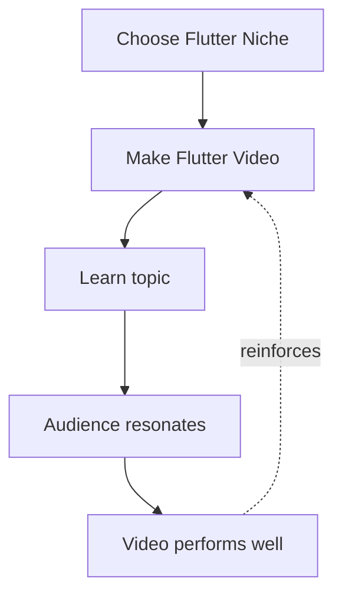
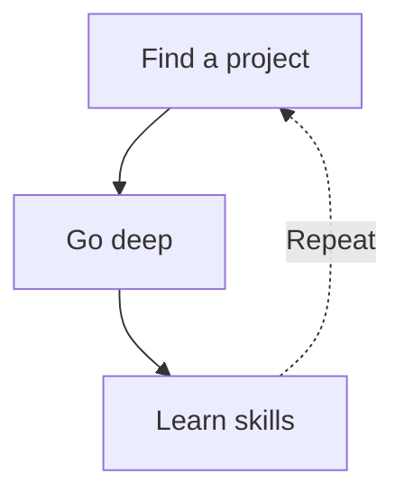

import AchievementCards from './_components/AchievementCards.tsx';
import ConcentricCircles from './_components/ConcentricCircles.tsx';
import Quote from './_components/Quote.tsx';
import johnLennon from './_assets/john-lennon.png';
import steveJobs from './_assets/steve-jobs.png';

In 2018-2022, I became one of the top Flutter influencers, but this was never my goal. In fact, it didn't feel right being associated with one specific technological niche.

The real goal when I started, was to build an app for my book club for my friends with both iOS and Android devices. Flutter allows you to write your app in one language (Dart), and compile to both operating systems.

So I chose to build this app using Flutter.

I first needed to learn Flutter using my usual method: binging YouTube tutorials. But, I ran into a problem. Since Flutter was still in beta, there was not much content on YouTube. I thought there should be. So, I took it upon myself to start making some.

The videos were terrible at the beginning, but then they got better and the audience started growing. I kept growing and improving my skills and eventually amassed an audience of 50,000 across multiple platforms, got recognized as a Google Developer Expert for Flutter & Dart, and became a Flutter Developer Advocate at Agora.

<AchievementCards client:load />

This was nice, but it was never my goal.

Throughout this journey, I fell in love with teaching. Even though I had no previous experience with formal teaching, I realized I’ve been doing it informally for most of my life with family members and friends. And I was relatively good at it. I love the challenge of getting to the core of a problem, then expressing that core in a clear and simple way.

YouTube was an incredible feedback loop for building this skill. If something wasn’t clear I could always trust the comments to correct me. Usually in a kind way, sometimes in a not-so-kind way.

## Why it didn’t feel right

Although the increasing follower number was nice, I tried to focus on intrinsic motivations. Creating these videos was incredibly fulfilling because the end result was a deep knowledge about the topics I made videos about. Since I started with Flutter, a reinforcement loop was created to continue making content about Flutter. ==This part doesn't flow nice.==

Initially this was great, and I was too busy to think about anything other than how to make my videos be less shitty. But eventually, I felt stuck. The reason I started this whole thing was because I wanted to build something. There is always more to learn, but I learned everything that I needed to build Flutter apps.

Behind the scenes I was building and learning about other technologies, specifically web development and backend development. I tried to create content related to that, but it didn't perform well since my audience was a Flutter audience. At this moment in my career I was pretty new at being a Flutter DevRel, so having my content do well was directly tied to my job. I had a really supportive leader (shoutout Hermes the GOAT), so I could have experimented more, but internally I want to add value to the company I worked for.

I stayed in this limbo mode of not really building with Flutter, but still kinda creating mostly exclusively educational Flutter content.  ==I was still making Flutter apps for work==

But yea, I think I'm done. Time to move on.

And I have mostly moved on the past 8+ months. I've built courses around Typescript and more general technologies, I work at ElevenLabs now as a DevRel and even though we have a Flutter SDK, I haven't really touched it and been focused on React since it's the most popular.

This isn't a reflection on Flutter as a technology. It's a reflection my goal being to build things. Some of the things might be physical things, some of them might be software, some of them might even be apps, and some of those apps might even be built with Flutter.

<ConcentricCircles  />

I don't want my life and my creations to just be limited to that smallest circle at the bottom.

## Reflections on this journey

I try to live life without any regrets and realize that it's all a journey, and this journey that I am on is just part of life. Maybe I could have done some things different, but maybe if I did I wouldn't be where I am today. Maybe I would in a better place? Maybe in a worse place? But spending my time thinking about those paths is a waste. Life can go in an infinite amount of directions, and I'm happy with the direction I am on.

For all I know, this path I have taken might be the most optimal path I could have taken.

1. Find a project you are curious about.
2. Go really deep in one specific niche of that project.
3. Learn a lot of skills along the way.
4. Apply those skills to a wider project.
5. Repeat.

If I were to give advice to my past self, the only thing I would change is to enjoy the journey a little more.

<Quote author="Steve Jobs" image={steveJobs.src} imageAlt="Steve Jobs portrait">
  You can’t connect the dots looking forward; you can only connect them looking backwards.
</Quote>

<Quote author="John Lennon" image={johnLennon.src} imageAlt="John Lennon portrait" imagePosition="right">
  Life is what happens to you while you’re busy making other plans.
</Quote>

## My thoughts about Flutter | Flutter vs React Native

Again, my decision to create other things is not a reflection of Flutter as a technology. I find the typical conversation on social media so cringe-y when people talk about "Flutter is the best", "React Native is the best", or whatever technology. It's a piece of tech, there's no reason to defend it like your life depends on it and no reason to put it on a pedestal (unless you are trying to sell something related to it).

Flutter is cool. It's a great way to build apps for any platform. I plan to continue to choose it whenever it makes sense.

But lately I've been building a lot of websites. Websites are different from web apps, and Flutter is not a good choice for websites. I've built sites in React, Svelte, Nextjs, SvelteKit, SolidJS, Astro, etc. My favorite web framework is Astro and I mostly use React components for reactivity.

I have grown to enjoy writing with React and I believe it's mostly due to Tailwind. Having your styling in one sections and easy to read is nice. Still, there are many parts that I don't enjoy with React. But this enjoyment of Tailwind led me to trying React Native with Nativewind. And I actually kind of like it.

// React Native Code vs Flutter Code

Native components also feel like a bigger deal than I initially thought. I personally don't really like Apple's Liquid Glass as a consumer (mostly due to the long animations and flashbangs), but to have an app you built contain Liquid Glass components feels very premium.

Also Expo, not only makes it easier for deploying and working with React Native apps, but they might actually fulfill the dream of having one codebase for websites and apps. There still is a lot more work needed, but server side rendering, middleware and other modern web necessities are in public alpha.

Again, I'm done "choosing sides". You can build great products with anything. The choice for what you use depends on the project you are working on and the people you are working with. If I was to choose a side, it would be the side of whoever builds the cooler thing.

## My Future

The main goal for me is to not restrain myself from exploring deeply and sharing things that I am curious about anymore. That means there will be some deep dives on topics that I have wanted to cover for years.

I also want to continue getting better and not worrying about the numbers as much and focusing on the quality of the output, and trust that if the quality continues to improve the numbers will follow.

If you want to follow along, there is a sign up form below.

We are so back.

---

I did try to break out, but I didn’t have the confidence in myself back then.

Niching down is still a good way to get noticed. But I no longer care about getting noticed. And if it happens I want to get noticed for things I care about.
