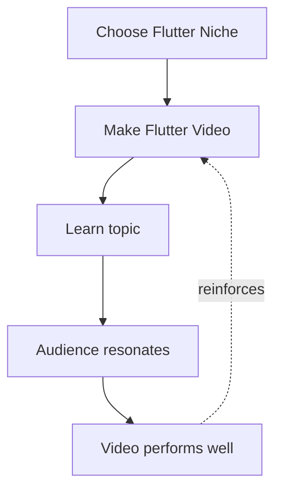
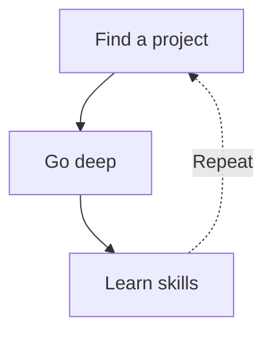

import AchievementCards from './_components/AchievementCards.tsx';
import ConcentricCircles from './_components/ConcentricCircles.tsx';
import Quote from './_components/Quote.tsx';
import CodeComparison from './_components/CodeComparison.astro';
import johnLennon from './_assets/john-lennon.png';
import steveJobs from './_assets/steve-jobs.png';

From 2018 to 2022, I became one of the top Flutter influencers, but this was never the goal.

The real goal, was to build a book club app that my friends could use on both iOS and Android devices. Flutter allows you to write your app in one language (Dart) and compile to both operating systems.

So I chose to build this app using Flutter.

Before I could build, I needed to learn Flutter. My favorite way to learn was to binge-watch YouTube tutorials. 

But I ran into a problem. 

Since Flutter was still in beta, there was not much content on YouTube. I thought there should be. 

So, I started making some. The videos were terrible at the beginning, but then they got better, and the audience started growing. I kept improving my skills and eventually amassed an audience of 50,000 across multiple platforms, got recognized as a Google Developer Expert for Flutter & Dart, and became a Flutter Developer Advocate at Agora.

<AchievementCards client:load />

I am deeply grateful for this, but it was not my goal.

Throughout this journey, I fell in love with teaching. Even though I had no previous experience with formal teaching, I realized I’ve been doing it informally for most of my life. I love the challenge of getting to the core of a problem, then expressing that core clearly and simply.

YouTube was an incredible feedback loop for building this skill. If something wasn’t clear, I could always trust the comments to correct me. Usually in a kind way, sometimes in a not-so-kind way.

## The Reinforcement Loop

Creating these videos was incredibly fulfilling because the result was a deep knowledge of the topics I made videos about. Since I started with Flutter, a reinforcement loop was created to continue making content about Flutter.

Initially, this was great, and I was too busy to think about anything other than how to make my videos less shitty. But eventually, I started to feel stuck. 

The reason I started learning Flutter was to build something, but I had learned enough to start building a few years ago.

At that point, I was more excited about building websites like my personal website or an education platform. Behind the scenes, this is what I was spending most of my time on: building and learning about web development and backend development. I tried to create content related to this, but it didn't perform well since my audience was built on Flutter. 

At this moment in my career, I was a new DevRel focused on Flutter, so having my content do well was directly tied to success at my job. I had a supportive leader (shoutout [@hermes_f](https://x.com/hermes_f)), so I had the freedom to experiment, but I still wanted my work to create clear value for the company.

I stayed in this limbo mode of mostly using Flutter for work demos and content, but learning and building websites in my spare time.

Eventually, I did expand my role at work to include web technologies, built a startup on the web, and joined an AI company.

But something inside still identifies with the Flutter niche. I think it's time for me to move on from this identity.

<ConcentricCircles  />

This isn't a reflection on Flutter as a technology. It's a reflection of my goal to build things. Some of the things might be physical things, some of them might be software, some of them might be apps, and some of those apps might even be built with Flutter.

I don't want my life and my creations to just be limited to that smallest circle at the bottom.

## Reflections on this journey

My meta goal in life is to look back when I'm 80+ years old without any major regrets. 

Life contains an infinite number of possible paths, and I’m content with the one I’m on and the place I’m in now. For all I know, this may have been the optimal path to become who I am today.

1. Find a project you are curious about.
2. Go deep into that niche.
3. Learn skills along the way.
4. Apply those skills to a wider project.
5. Repeat.

If I were to advise my past self, the only thing I would change is to enjoy the journey a bit more.

<Quote author="Steve Jobs" image={steveJobs.src} imageAlt="Steve Jobs portrait">
 You can’t connect the dots looking forward; you can only connect them looking backwards.
</Quote>

<Quote author="John Lennon" image={johnLennon.src} imageAlt="John Lennon portrait" imagePosition="right">
 Life is what happens to you while you’re busy making other plans.
</Quote>

## My opinions about Flutter

Again, my decision to broaden my scope is not a reflection of Flutter as a technology.

Flutter is cool. It's a great way to build apps for any platform. I plan to continue to choose it whenever it makes sense. 

But I have experimented with many other technologies over the years.

Lately, I've built a lot of websites. Websites are different from web apps, and while Flutter *can build web apps*, it is not a good choice for websites. I've built sites in React, Svelte, NextJS, SvelteKit, SolidJS, Astro, etc. 

My favorite of these is Astro, and I have grown to tolerate React. I believe it's mostly due to Tailwind. Having your styling short, easy to read, and on one line is nice. Still, there are many parts that I don't enjoy with React. 

This enjoyment of Tailwind led me to recently try React Native with Nativewind, and I also enjoy it.

The code below renders the same output, but React Native with Nativewind does it with a fraction of the code.

<CodeComparison />

Native components also feel like a bigger deal than I initially thought. Personally, I don't like Apple's Liquid Glass as a consumer due to the long animations and flashbangs when you press anything. But building apps with Liquid Glass components makes them feel premium.

Expo is another incredible technology that makes React Native ecosystem nice. It not only makes it easier to deploy and work with React Native apps, but it might actually fulfill the dream of having one codebase for websites and apps. There is more work needed, but server-side rendering, middleware, and other modern web necessities are in public alpha.

Flutter has its benefits as well. The developer tooling is incredible and I have complete confidence in it to find the root issue fast. Also having desktop (including Linux) and even embedded system support feels like true cross platform other than websites.

But, you can build great products with anything. The choice for what you use depends on the project you are working on and the people you are working with. If I were to choose a side, it would be the side of whoever builds the cooler thing.

## My Future

My current goal is to no longer restrain myself from exploring my curiosities deeply, building what excites me, and sharing things that I am curious about. 

I want to continue improving my skills while not worrying about the numbers as much. Instead, focus on the quality of the output and trust that if the quality continues to improve, the results will follow.

We are so back.