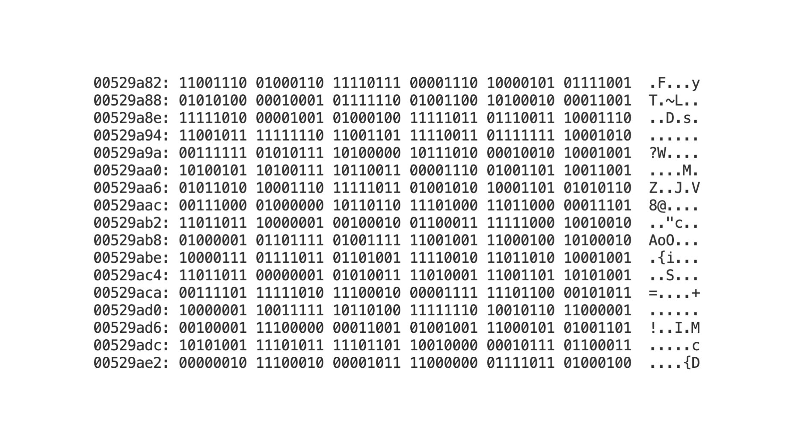

import SwitchAndGate from './_components/SwitchAndGate.tsx';
import TransistorAndGate from './_components/TransistorAndGate.tsx';
import SwitchAndTransistor from './_components/SwitchAndTransistor.tsx';
import RGBLightDemo from './_components/RGBLightDemo.tsx';

How does the same thing that turns on a light bulb:

1. create realistic-looking video games
2. allow you to see someone in real-time on the other side of the planet
3. and now, it has its own thoughts???

And all this is created by typing words in a specific sequence on a computer.

It all seems like magic, but magic doesn't exist.

To begin understanding computers, let's look at how the first computers were invented.

## Boolean Logic

It all started in the 1840s, when George Boole tried to mathematize logic. At that point, *logic* was a branch of philosophy.

Logical philosophy is credited to Aristotle, and it was a method for thinking clearly. It was used to find what is true based on other truths or falsehoods. For example:

1. All humans are mortal,
2. Socrates is a human,
3. Therefore, Socrates is a mortal

The logic flows like this:

1. The first line is true.
2. The second line is true.
3. Since both are true, the third line must be true as well.

If the second line was false, then the third line would be false as well.

Before George Boole, this was all done linguistically, using full sentences. Boole wanted to make this logic clearer and rigorous like mathematics. His goal was to bring clarity to these philosophical discussions.


He released this new system to the world in his book *The Mathematical Analysis of Logic*. This system eventually became known as *Boolean Algebra*.

Boolean Algebra consisted of three core operations:

- AND - result is true if both inputs are true
- OR - result is true if at least one input is true
- NOT - result is the opposite of the input

If we go back to our previous example, this can now be expressed using Boolean algebra. If A is true and B is true, then the third line **must be true** due to the AND operation of Boolean Algebra.

1. A: All humans are mortal,
2. B: Socrates is a human,
3. A **AND** B: Therefore, Socrates is a mortal

Until the 1930s, Boolean Algebra was used mainly to help philosophers be more precise and clear with their logical arguments.

That is, until Claude Shannon, while working on his master's thesis, realized you can apply Boolean Algebra to circuits. In circuits, electricity can be in 2 states: ON and OFF, similar to how Boolean Algebra has two states: TRUE or FALSE. He was curious whether these two could be connected. Eventually, he proved that they are by showing that you can write an equation to calculate the output of a circuit using Boolean algebra.

This was an incredible realization, because until then, circuits were built on the fly. There were no pre-planned circuits, which means they couldn't be very complicated.

Now with Boolean algebra, you can start designing bigger and more complicated circuits on paper, and push the limits of what is possible with circuit design.

But there was one more key breakthrough that was necessary before we could have the technological boom.

This Boolean Logic was represented by physical switches. That means someone has to physically change the switch to execute logic with circuits.

This is where transistors come in and change everything.

## The Transistor

The transistor allows you to implement logic that can change without any physical alterations. It can change logic using only electricity. **This is considered one of the greatest inventions of the 20th century.**


A transistor is similar to a switch, but instead of having to move it up and down, you apply a voltage to the **Base**.

<SwitchAndTransistor client:load />

There are 3 parts to the most common transistor, called a Bipolar Junction Transistor.

- Collector: Connected to power
- Emitter: Output
- Base: The "switch" that controls whether electrons can travel from the Collector to the Emitter

When the **Base** has voltage, it acts like a closed switch, and electricity can flow. When the **Base** does not have voltage, it acts like an open switch, and electricity cannot flow.

## Logic Gates

So now we have Boolean Algebra, which has been applied to circuits, and we have transistors that allow circuits to be controlled without manually flipping switches.

We can put this all together and understand the basic components of a computer: **Logic Gates.**

We've been using the AND logic in our examples thus far, so let's create an AND logic gate.

When using switches, it would be two switches in a row (*in series*, as the nerds call it). If both A and B are open, electricity does not flow. If only one of them is open, it still does not flow. But if **A AND B** are closed, electricity flows.

<SwitchAndGate client:load />

Now with transistors, we can do the same thing without physical switches. Electricity is coming from the top. If neither A nor B has voltage, electricity does not flow. If only one of them has voltage, it still does not flow. But if both **A AND B** have voltage, electricity flows.

<TransistorAndGate client:load />

There are many other logic gates, but they are all built on similar fundamentals to the AND gate, with different layouts.

## Binary Representation

So now, who controls whether the transistors should let the voltage pass?

Programs.

The field of programming is essentially telling which transistors whether they should let electricity pass through or not.

The first programs looked like this:


You would feed this punch card to a computer that filled up an entire room. It would detect whether there were holes in the punch card. If there was a hole in the punch card, that would mean that the transistor should be ON; if there was no hole, then it should be OFF.


Eventually, things became more digital, where the ON/OFF state is represented by a binary number (either a 1 or 0).

- 1 represents the ON state
- 0 represents the OFF state

Instead of a punch card, your programs now use sequences of binary numbers that look like this:

```
00010110101011010101010110101010101010101010101010101010010101
```

This sequence of 1's and 0's controlled when the transistors should be in the **ON** or **OFF** state and thus allowed the computer to do whatever the programmer wanted it to do.

These 1's and 0's are still used to this day.

Let's use your computer screen to walk through an example. Your screen is millions of individual pixels. And each of these can be many different colors using RGB. This means every pixel is actually 3 different (red, green, blue) lights that, when paired together, can make a wide range of colors.

<RGBLightDemo client:load />

Each one of these lights can be **ON** or **OFF**. If the red light is programmed to be **ON** and the other two are **OFF**, your pixel will show red. If red and green are on, you make yellow. And if all 3 are on, you make white. To turn on a pixel, you write a program that tells each of these individuals' lights to turn on, depending on what color you want.

Of course, there is a ton of complexity I am skipping over here, but essentially, this is how programs control your computer.

## Programming Languages

But if you've seen a commonly used programming language before, it's not written in 1's and 0's. This happened through many years of abstracting away the 1's and 0's into letters and words that are more readable and easier to program with for humans.

It first started with assembly code. Each piece of assembly code is correlated to its binary equivalent. For example, the binary code that lets the transistors know to add two numbers might be `01010101101101011010101010001000111010111011101111`, and in assembly, this would just be `add`. Now, instead of writing all those 1's and 0's, you can write the word `add` followed by the number, and use something called a compiler to turn that text into the 1's and 0's for the computer to understand. This is called compiling a program.

And now your programs might look something like this.

```txt
mov eax, 5
mov ebx, 3
add eax, ebx
```

In this example, `eax` and `ebx` are storage locations (called registers) for that specific computer. It first stores the value 5 into register `eax`, then 3 into register `ebx`. At the end, it adds the values stored in both registers and stores the result back in `eax`.

With assembly code, you still need to understand the system. For example, you still have to remember where the memory locations are and keep track to make sure they're not being accidentally overwritten.

So, more abstraction layers were added, like the C programming language. Then, even more layers got added on top of C to give us a higher-level language like Dart.

```dart
var a = 2;
var b = 3;
var c = a + b;
```

While assembly was directly tied to the binary, Dart is not. When writing Dart code, we don't have to remember which memory location we are storing to. We can use variables and operators to write in a human-readable way, similar to how we solve math problems.

But this comes with a bit more complexity for the computer.

With assembly, the compiler was mostly converting the written words into 1's and 0's, but the compilers used in modern programming languages are way more complicated. They are filled with complicated algorithms used to make the decisions that humans had to make with binary and assembly. For example, the compiler now decides the location where the data gets stored, making sure not to overwrite that location, and also cleans it up when it's no longer being used.

But the result is still the same. You end up with 1's and 0's that either allow electricity to go through a transistor or not.

You can actually see these 1's and 0's by first compiling your Dart program using `dart compile exe your-file-name.dart`, which creates a compiled program that is runnable on any computer. And you can see the contents of that file by running `xxd -b your-file-name.exe` on a Mac.



On the left side, you have the offset (memory address within the file), followed by the actual binary, followed by the ASCII representation of the binary. ASCII is a way to represent letters and characters with binary, but that deep dive is for a different article.
